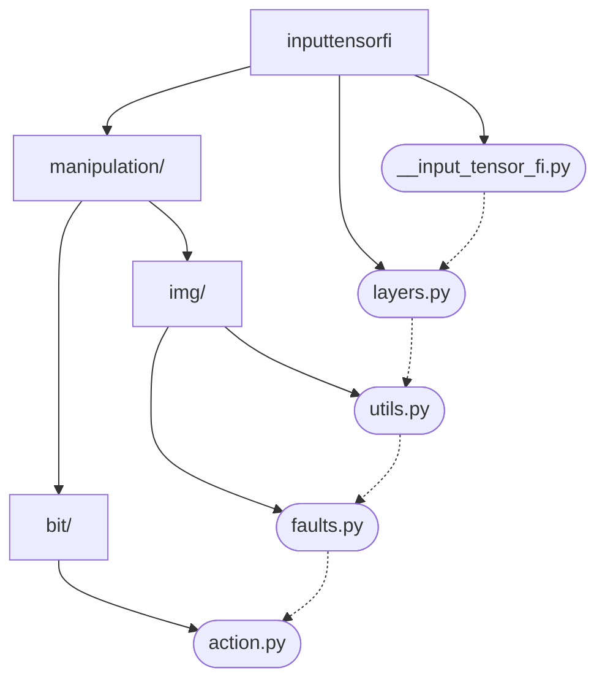
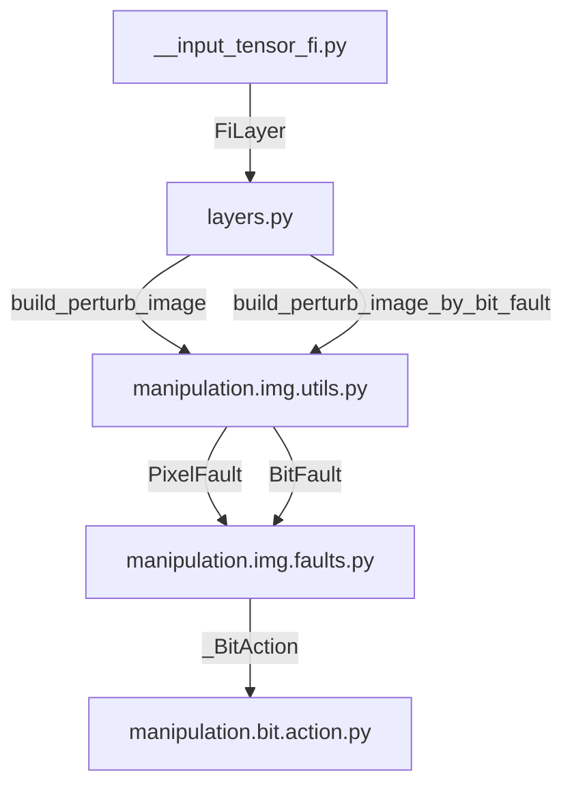

# Methods

## Why this project ?

- It's a one month school project.
- [One Pixel attack for fooling deep neural networks](https://arxiv.org/abs/1710.08864).
- Need to use fault injection as a tensor.

## Objectives

- Use Fault Injection as a tensor (Perturb images using a tensor)
- Inject fault on a semi-black box model (only know inputs and outputs)

## Principle

The fault injection is a numpy function and can be used without a tensor. For example:

```python
output = fault_injection(input)
```

If a fault injection need some parameters, we use the builder pattern:

```python
def build_fault_injection(args):
    def fault_injection(input):
        # Do something with intput and use args
        return some_calculus(intput, args)
    return fault_injection
```

```python
fault_injection = build_fault_injection(args)
# ...
output = fault_injection(input)
```

Using this pattern, we build a numpy function that has **only** `input` (the image) as function parameters.

This allows us to build a tensor using `tf.numpy_function` :

```python
fault_injection = build_fault_injection(args)
# ...
tf.numpy_function(fault_injection, [input], dtype)  # Use the input dtype
```

Thus, also allows us to build a Keras layer by inheriting `tf.keras.layers.Layer` :

```python
class FiLayer(tf.keras.layers.Layer, metaclass=ABCMeta):
    """A Keras layer marked with fault injection.

    This is an abstrac class. Implementations are stored along this class.
    """

    def __init__(
        self,
        name=None,
        dtype=tf.uint8,
        dynamic=False,
        **kwargs,
    ):
        super(FiLayer, self).__init__(
            trainable=False, name=name, dtype=dtype, dynamic=dynamic, **kwargs
        )

class MyFiLayer(FiLayer):
    def __init__(self, args, dtype: tf.DType):
        super(MyFiLayer, self).__init__(dtype=dtype)
        self.fault_injection = build_fault_injection(args)

    def call(self, input, training=False):
        if not training:
            return tf.numpy_function(self.fault_injection, [input], self.dtype)
        else:
            logging.warning("MyFiLayer is ignored on training.")
            return input
```

To prepend that layer to a Model, we simply use Keras `Sequential ` and we build a `Sequential` model :

```python
def build_faulted_model(model: tf.keras.Model):
    args: Any  # TODO: Replace by your own args
    input_dtype: tf.Dtype  # TODO: Replace by your own input_dtype

    faulted_model = tf.keras.Sequential(
        layers=[
            tf.keras.layers.Input(
                dtype=input_dtype, shape=model.input_shape[1:]
            ),
            MyFiLayer(args, input_dtype),
            model,
        ]
    )
    faulted_model.compile(
        loss=tf.losses.CategoricalCrossentropy(from_logits=True),
        metrics=[tf.metrics.CategoricalAccuracy()],
    )
    return faulted_model
```

The `faulted_model` cannot be trained (and shouldn't be).

For the usage, see the `README.md`.

## Architecture

**Since this documentation is repetitive, this document can be outdated.**

Use the [Github Mermaid Extension](https://github.com/BackMarket/github-mermaid-extension).

Folder structure (and dependency graph) :




Dependency graph :



