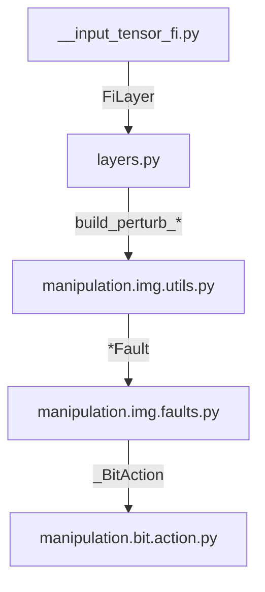

# Methods

## Why this project ?

- It's a one month school project.
- [One Pixel attack for fooling deep neural networks](https://arxiv.org/abs/1710.08864).
- Need to use fault injection as a tensor.

## Objectives

- Use Fault Injection as a tensor (Perturb images using a tensor)
- Inject fault on a semi-black box model (only know inputs and outputs)

## Base Principle (Numpy-based)

The fault injection is a numpy function and can be used without a tensor. For example:

```python
output = fault_injection(input)
```

If a fault injection need some parameters, we use the builder pattern:

```python
def build_fault_injection(args):
    def fault_injection(input):
        # Do something with intput and use args
        return some_calculus(intput, args)
    return fault_injection
```

```python
fault_injection = build_fault_injection(args)
# ...
output = fault_injection(input)
```

Using this pattern, we build a numpy function that has **only** `input` (the image) as function parameters.

This allows us to build a tensor using `tf.numpy_function` :

```python
fault_injection = build_fault_injection(args)
# ...
tf.numpy_function(fault_injection, [input], dtype)  # Use the input dtype
```

Thus, also allows us to build a Keras layer by inheriting `tf.keras.layers.Layer` :

```python
class FiLayer(tf.keras.layers.Layer, metaclass=ABCMeta):
    """A Keras layer marked with fault injection.

    This is an abstract class. Implementations are stored along this class.
    """

    perturb_image: Callable

    def __init__(
        self,
        name=None,
        dtype=tf.uint8,
        dynamic=False,
        **kwargs,
    ):
        super(FiLayer, self).__init__(
            trainable=False, name=name, dtype=dtype, dynamic=dynamic, **kwargs
        )

    def call(self, input, training=False):
        if not training:
            return tf.vectorized_map(
                fn=self.perturb_image,
                elems=input,
            )
        else:
            logging.warning(f"{type(self).__name__} is ignored on training.")
            return input
```

```python
class MyFiLayerUsingNumpy(FiLayer):
    def __init__(self, args, dtype: tf.DType):
        super(MyFiLayer, self).__init__(dtype=dtype)
        transform = build_perturb_image(pixels)
        
        # Each img are going to invoke this function
        self.perturb_image = lambda x: tf.numpy_function(
            transform, [x], self.dtype
        )
```

To prepend that layer to a Model, we simply use Keras `Sequential ` and we build a `Sequential` model :

```python
def build_faulted_model(model: tf.keras.Model):
    args: Any  # TODO: Replace by your own args
    input_dtype: tf.Dtype  # TODO: Replace by your own input_dtype

    faulted_model = tf.keras.Sequential(
        layers=[
            tf.keras.layers.Input(
                dtype=input_dtype, shape=model.input_shape[1:]
            ),
            MyFiLayer(args, input_dtype),
            model,
        ]
    )
    faulted_model.compile(
        loss=tf.losses.CategoricalCrossentropy(from_logits=True),
        metrics=[tf.metrics.CategoricalAccuracy()],
    )
    return faulted_model
```

The `faulted_model` cannot be trained (and shouldn't be).

For the usage, see the `README.md`.

## Tensorflow-based Principle

A perturbation can also be directly a **Tensor** instead of a **numpy function**.

For example, this pixel fault injection:

```python
def build_perturb_image(
    pixels: np.ndarray,
):
    """Build a Fault Injector using [pixels] to be faulted.

    Args:
        pixels (np.ndarray(dtype=PixelFault)):
                A list of pixels to be faulted.
    """
    def perturb_image(img: np.ndarray) -> np.ndarray:
        for pixel in np.nditer(pixels, flags=["refs_ok"]):
            item = pixel.item()
            img[item.x, item.y] = item.rgb

        return img

    return perturb_image
```

Can be translated to :

```python
def build_perturb_image_tensor(pixels: np.ndarray):
    """Build a Fault Injector using [bit_faults] to be faulted.

    Optimized for tensors.

    Args:
        bit_faults (dtype=BitFault):
                A list of pixels to be bit-faulted.
    """
    indices = [(pixel.x, pixel.y) for pixel in pixels]
    values = np.array([pixel.rgb for pixel in pixels])

    def perturb_image(x: tf.Tensor) -> tf.Tensor:
        return tf.tensor_scatter_nd_update(
            x,
            indices,
            values,
        )

    return perturb_image
```

Which is more efficient in Tensorflow at runtime.

Using this method, we don't need anymore `tf.numpy_function` and we can use directly the perturbation:

```python
class PixelFiLayer(FiLayer):
    def __init__(self, pixels: np.ndarray, dtype: tf.DType = tf.uint8):
        super(PixelFiLayer, self).__init__(dtype=dtype)
        self.pixels = pixels
        transform = build_perturb_image(pixels)
        self.perturb_image = lambda x: tf.numpy_function(
            transform, [x], self.dtype
        )
        
        
class PixelFiLayerTF(FiLayer):
    def __init__(self, pixels: np.ndarray, dtype: tf.DType = tf.uint8):
        super(PixelFiLayerTF, self).__init__(dtype=dtype)
        self.pixels = pixels
        self.perturb_image = build_perturb_image_tensor(pixels)
```

This is much better and more efficient. However, the learning curve is steep as a good knowledge of the tensorflow operation list is required.

## Architecture

**Since this documentation is repetitive, this document can be outdated.**

Use the [Github Mermaid Extension](https://github.com/BackMarket/github-mermaid-extension).

Folder structure (and dependency graph) :


Dependency graph :



